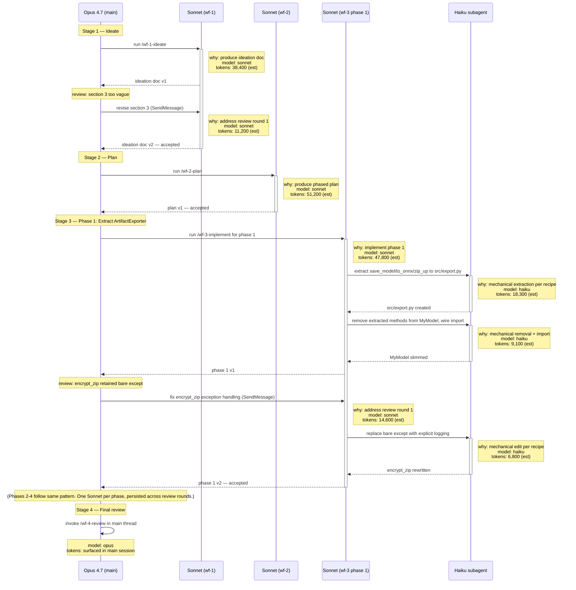

# Delegated Build

When the user invokes `/delegated-build`, follow the protocol below for the duration of the implementation work. The protocol governs (a) which subagent + model to use for each piece of work, (b) which work stays in the main thread, and (c) how multi-agent activity is traced.

## Routing convention

The default chain is:

1. **Main thread (Opus)** spawns a **Sonnet subagent** to run `/wf-1-ideate` for the task. Sonnet returns an ideation doc. Opus reviews it in the main thread.
2. **Main thread (Opus)** spawns a **Sonnet subagent** to run `/wf-2-plan` for the task. Sonnet returns a plan. Opus reviews it in the main thread.
3. For each phase in the plan: **Main thread (Opus)** spawns a **Sonnet subagent** to run `/wf-3-implement` for that phase. Inside wf-3, Sonnet dispatches **Haiku subagents** for the actual mechanical implementation work (file edits, renames, boilerplate). Sonnet integrates the Haiku results and returns the completed phase. Opus reviews the phase result in the main thread before moving to the next phase.
4. After all phases land, build completes. Do NOT do automated review or push to remote. User will review results and push as needed. 

The main thread never does code generation. It plans, dispatches, and reviews.

### Inside `/wf-3-implement` (Sonnet's job)

Sonnet running wf-3 is responsible for:
- Decomposing the phase into mechanical units that Haiku can execute from a recipe.
- Spawning one Haiku subagent per unit (or batching closely-related units into one Haiku call).
- Reading back Haiku's output to verify the recipe was followed; re-tasking via SendMessage if not.
- Returning a phase-complete summary to the main thread.

If a unit of work would require Haiku to read neighboring code to figure out the shape, that's not mechanical — Sonnet does it directly inside wf-3 instead of dispatching to Haiku.

### Persistence and re-tasking

When Opus reviews a Sonnet subagent's output and finds issues, **re-task the same Sonnet subagent via `SendMessage`** rather than spawning a fresh one. SendMessage resumes the subagent with full context — all the project context Sonnet built up while running the workflow stays available, and the revision is scoped to just the feedback. A new `Agent` call would start fresh and lose everything (re-paying the ~10K baseline plus all initial file reads).

The Sonnet subagent for a given workflow stage (wf-1, wf-2, or one phase of wf-3) **persists across all review rounds for that stage** until Opus accepts the output. Only when Opus accepts does that Sonnet's job end. The next workflow stage gets a fresh Sonnet subagent.

The same persistence DOES NOT apply to Haiku subagents inside wf-3 — if Sonnet finds the Haiku output didn't follow the recipe, spin up a new Haiku agent with limited scope to fix the specific issue. If that fails once, spin up a Sonnet sub-agent to fix. If that fails, abandon effort. 

**Exception — when to abandon and respawn:** if review rounds exceed ~4 on the same stage, that's a signal the brief is under-specified or the scope has drifted. Return to the main thread, refine the task with Opus, and start a fresh Sonnet rather than continuing to patch the existing one.

### Heuristics for deviating from the default chain

- If the user already has an ideation doc and plan in hand, skip steps 1–2 and start at step 3.
- For a single-phase change, run wf-3 once; otherwise one wf-3 subagent per phase.
- If a phase turns out to need genuine architectural judgment mid-flight (Sonnet's wf-3 hits an open question), return to the main thread, resolve it with Opus, then re-task the existing wf-3 Sonnet via SendMessage with the resolution. Do not let Sonnet escalate to Opus inside wf-3 — return to main thread.
- The built-in `Explore` agent (Sonnet, default) is still available for ad-hoc codebase queries from the main thread between phases. The `Plan` agent is *not* the planning vehicle here — `/wf-2-plan` replaces it.

## Context-rot discipline

- The main thread should accumulate only: phase-completion notes, the user's directives, and review summaries. Everything else (file reads, search results, debug output, generated code) lives in subagent contexts.
- Between phases, write a brief completion note in the main thread: what changed, what's next, any non-obvious facts learned. The main thread carries forward the note, not the underlying work.
- Do not re-read files just to refresh memory — trust the file-state tracking and Edit/Write feedback.

## Tracing

Maintain a mermaid sequence diagram at `docs/workflow/2026q3_swappable-models/agent-trace.md` (or a path the user specifies on invocation; for other workflows, default to `docs/workflow/<active-workflow>/agent-trace.md`).

Append a new entry every time a subagent is spawned or re-tasked. Each entry must record:

- **Why** the subagent was spawned or re-tasked — one short clause.
- **Model** used — `opus` / `sonnet` / `haiku`.
- **Tokens** consumed by the subagent. If the agent tool result surfaces an actual token count, use it. Otherwise estimate as:
  - Initial spawn: `tokens ≈ ⌈prompt_chars / 4⌉ + ⌈response_chars / 4⌉ + 10000`
  - SendMessage re-task: `tokens ≈ ⌈prompt_chars / 4⌉ + ⌈response_chars / 4⌉` (no +10K baseline — the subagent's context is already loaded)
  - The +10K baseline accounts for the subagent's system prompt, tool definitions, and any initial context load. It is rough — do not pretend otherwise.
  - Mark estimated values with a trailing `(est)`, e.g. `tokens: 32,700 (est)`.

Group entries under a `Note over Main: Stage N — <name>` header so stages are visually separable. After each subagent return, append a return arrow with a one-clause result summary.

For nested calls (Sonnet → Haiku inside wf-3), show the nesting in the diagram — the Haiku activations sit between Sonnet's activation and deactivation.

For persistent re-tasked subagents (Opus reviews → SendMessage → Sonnet revises), represent the subagent as a **single activation spanning all review rounds**. Use undeactivated return arrows (`Sonnet-->>Main: v1`, no minus sign) for intermediate revisions, and only deactivate (`Sonnet-->>-Main: accepted`) when Opus accepts the final output. Each revision message gets its own `Note right of` block with the revision-specific why/model/tokens.

Update the diagram immediately after each subagent returns or is re-tasked — do not batch updates to end-of-stage, since the diagram's value is partly forensic (catching surprise model choices in flight).

If the trace file does not yet exist when the skill kicks off, create it with a top-level heading, a one-line note explaining the `(est)` suffix and the persistent-activation convention, and an opening fenced ```mermaid block. Append entries inside the block. If a stale diagram already exists, do not overwrite — start a new `## Run YYYY-MM-DD <task name>` section with its own fenced block.

## Example mermaid sequence diagram

This is the shape the trace file should grow into during a multi-phase build. Note the persistent activations across revision rounds (single `+`/`-` pair spanning multiple message exchanges) and the nested Sonnet → Haiku calls inside wf-3:



## Failure modes to avoid

- **Do not spawn a subagent just to satisfy the protocol.** If the work is genuinely a one-line edit or a quick read of a known file, do it in the main thread.
- **Do not pick Haiku for work that requires reading existing patterns to figure out the shape.** "Mechanical" means recipe-driven; if Haiku would have to look at neighboring code to infer conventions, Sonnet does it directly.
- **Do not respawn a fresh subagent when re-tasking would do.** Review iterations on the same workflow stage go to the existing Sonnet via SendMessage. Only respawn when starting a new stage, or when review rounds exceed ~4 (signal of under-specification).
- **Do not let Sonnet escalate to Opus from inside wf-3.** If Sonnet hits architectural judgment that needs Opus, Sonnet returns to the main thread with the open question; Opus resolves and re-tasks the same wf-3 Sonnet (SendMessage) with the resolution.
- **Do not skip the trace update because the diagram is getting long.** Length is the point — the diagram is a forensic record of model usage.
- **Do not strip the `(est)` suffix when it applies.** Honest gaps and honest estimates are more useful than confidently-wrong numbers.
- **Do not let subagents spawn beyond the documented depth (Main → Sonnet → Haiku).** No Haiku-spawning-anything, no Sonnet-spawning-Sonnet inside wf-3.

## When to skip this skill

- Single-file edits or one-shot fixes — the protocol is overkill.
- Pure investigation/Q&A with no code changes — use the appropriate agent directly without ceremony.
- The user has explicitly said "go fast" or "do not over-orchestrate".
